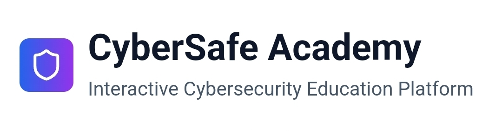

# 🛡️ Cyber Safe Academy

<div align="center">
  


**A modern, interactive learning platform for data protection and cybersecurity**

[](https://vitejs.dev/)
[](https://reactjs.org/)
[](https://www.typescriptlang.org/)
[](https://tailwindcss.com/)

**[🌐 View Live Demo](https://cyber-safe-academy.vercel.app)**

</div>

---

## 📖 About the Project

Cyber Safe Academy is an innovative, interactive web application that teaches cybersecurity and data protection in a completely new way. Instead of just reading about security risks, users can experience and learn through realistic simulations.

### ✨ Key Features

🎯 **6 Interactive Demos:**
- 📧 **Phishing Detection** - Simulated email inbox for identifying threats
- 📶 **WiFi Security** - Mobile interface for network selection and security awareness  
- 🔐 **Password Security** - Interactive password generator with real-time strength checking
- 🔐 **Two-Factor Authentication** - Complete 2FA setup and login simulation
- 🔄 **Software Updates** - Update notification interface with security implications
- 💾 **Data Backup** - Backup configuration dialog with security considerations

### 🎨 Design & User Experience

- **🎨 Minimalist Design** - Clean aesthetic with ample white space
- **📱 Responsive Layout** - Works perfectly on all devices
- **🚀 Seamless Transitions** - Modal/overlay system without page reloads
- **💬 Instant Feedback** - Educational feedback for all user actions
- **✨ Subtle Animations** - CSS/SVG animations to enhance user experience

## 🛠️ Technology Stack

This project was built with **Vite** and uses cutting-edge web technologies:

- ⚡ **Vite** - Ultra-fast build tool and development server
- ⚛️ **React 18** - Modern UI library with hooks
- 📘 **TypeScript** - Type safety and better developer experience
- 🎨 **Tailwind CSS** - Utility-first CSS framework
- 🧩 **Shadcn/ui** - High-quality, customizable UI components
- 📱 **Responsive Design** - Mobile-first approach

## 🚀 Installation & Development

### Prerequisites
- Node.js (version 18 or higher)
- pnpm (recommended) or npm

### Setup

```bash
# Clone the repository
git clone <repository-url>
cd cybersecurity-education

# Install dependencies
pnpm install

# Start development server
pnpm dev

# Build for production
pnpm build

# Preview production build
pnpm preview
```

## 📁 Project Structure

```
cybersecurity-education/
├── 📁 src/
│   ├── 📁 components/          # React components
│   │   ├── 📧 PhishingDemo.tsx
│   │   ├── 📶 WiFiSecurityDemo.tsx
│   │   ├── 🔐 PasswordSecurityDemo.tsx
│   │   ├── 🔐 TwoFactorDemo.tsx
│   │   ├── 🔄 SoftwareUpdatesDemo.tsx
│   │   └── 💾 DataBackupDemo.tsx
│   ├── 📁 hooks/               # Custom React hooks
│   ├── 📁 lib/                 # Utility functions
│   ├── 🎨 App.tsx              # Main application component
│   └── 🎯 main.tsx             # Application entry point
├── 📁 public/                  # Static assets
├── ⚙️ vite.config.ts           # Vite configuration
├── 🎨 tailwind.config.js       # Tailwind configuration
└── 📘 tsconfig.json            # TypeScript configuration
```

## 🎯 Features in Detail

### 📧 Phishing Demo
Realistic email simulation where users can examine suspicious emails, check sender details, and identify phishing attempts.

### 📶 WiFi Security
Mobile interface for selecting WiFi networks with demonstration of security risks and protective measures like VPN and HTTPS.

### 🔐 Password Security
Interactive generator with real-time password strength analysis and best practice recommendations.

### 🔐 Two-Factor Authentication
Complete simulation of 2FA setup and usage to demonstrate the additional security layer.

### 🔄 Software Updates
Interface for update notifications with explanation of security implications of delayed updates.

### 💾 Data Backup
Backup configuration dialog with various options and security considerations.

## 🌟 View Demo

**[🌐 Live Demo: https://cyber-safe-academy.vercel.app](https://cyber-safe-academy.vercel.app)**

Experience all interactive demos directly in your browser!

## 🤝 Contributing

Contributions are welcome! Please create a fork of the repository and submit a pull request.

## 📄 License

This project is licensed under the MIT License.

---

<div align="center">

**Built with ❤️ and Vite**

*Learn cybersecurity through hands-on experience!*

</div>
